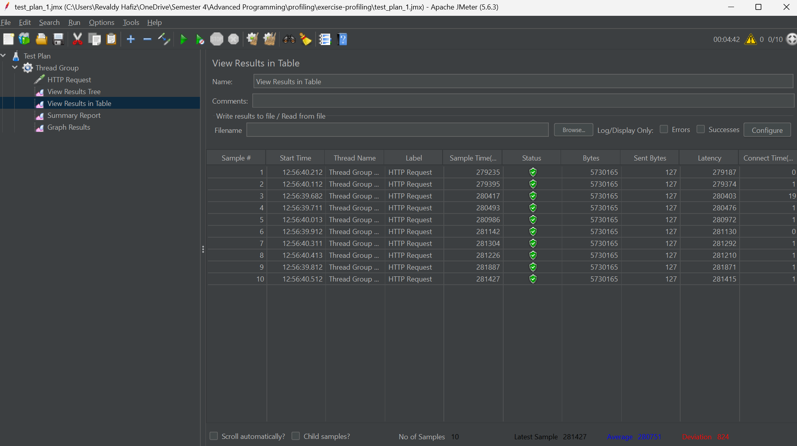
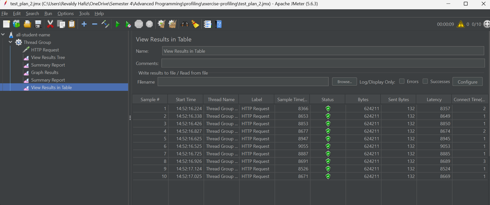
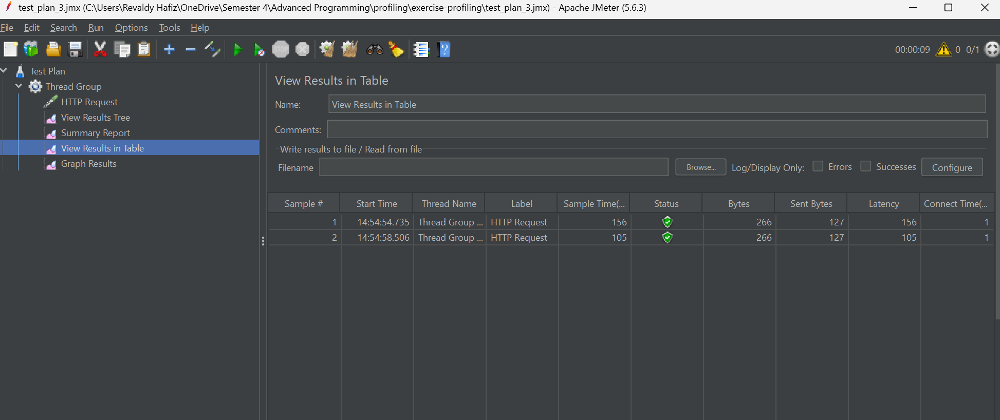
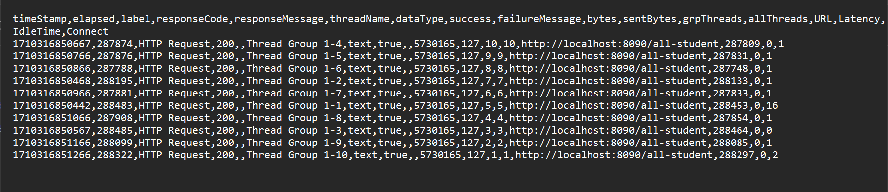
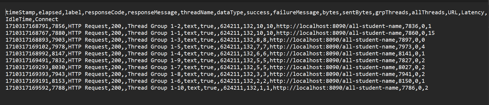
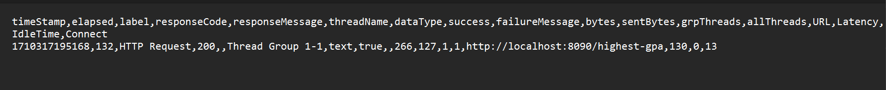
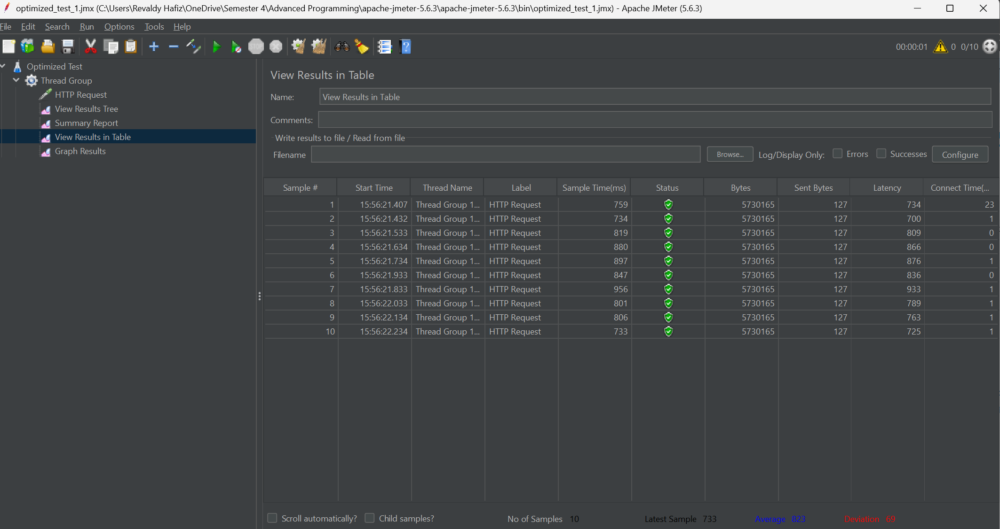
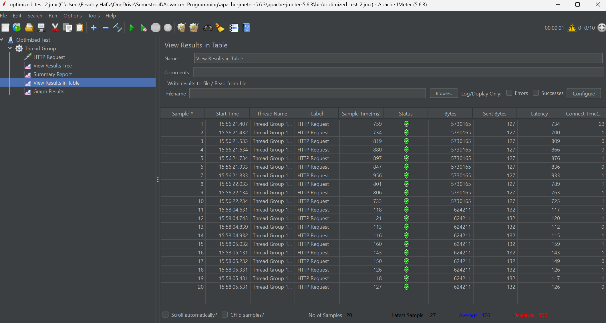
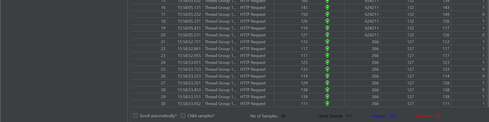

# Profiling Exercise
Otimized version can be found in the `optimized` branch.

## Screenshots

### Jmeter Test Plan (Unoptimized)

1. **/all-student EndPoint** *(test_plan_1.jmx)*
   

2. **/all-student-names EndPoint** *(test_plan_2.jmx)*
   

3. **/highest-gpa EndPoint** *(test_plan_3.jmx)*
   

### Command Line Test Plan (Unoptimized)

1. **/all-student Log**
   

2. **/all-student-name Log**
   

3. **/highest-gpa Log**
   

### Jmeter Test Plan (Optimized)

1. **/all-student EndPoint** *(optimized_test_1.jmx)*
   

2. **/all-student-name EndPoint** *(optimized_test_2.jmx)*
   

3. **/highest-gpa EndPoint** *(optimized_test_3.jmx)*
   

## Reflections

### Profiling Conclusion
After doing some refactoring, I was able to optimize the code and reduce the response time of the API. I even managed to improve a bit on the /highest-gpa endpoint
by modifying the`findStudentWithHighestGpa()` where i utilizes the Stream API to convert the list of students into a stream, but for the rest of the endpoint,
i utilize a `Map` to improve performance where it basically reduce the number of database calls and optimizing string concatenation.

### Reflections 5

1 **What is the difference between the approach of performance testing with JMeter and profiling with IntelliJ Profiler in the context of optimizing application performance?**

JMeter simulates multiple users accessing the application simultaneously, focusing on load testing, while IntelliJ Profiler analyzes the application's performance at a code level, identifying bottlenecks and optimizing execution time.

2. **How does the profiling process help you in identifying and understanding the weak points in your application?**

Profiling with IntelliJ Profiler provides detailed insights into method execution times, memory usage, and CPU usage. This helps in identifying weak points in the application, allowing for a better accurate approach to optimizing the application.

3. **Do you think IntelliJ Profiler is effective in assisting you to analyze and identify bottlenecks in your application code?**

Yes, i do think  IntelliJ Profiler is effective as it offers detailed performance metrics, aiding in the identification of bottlenecks and areas for optimization and for further development.

4. **What are the main challenges you face when conducting performance testing and profiling, and how do you overcome these challenges?**

The main challenge is to identify the root cause of performance issues and bottlenecks. This can be overcome by using a combination of performance testing tools like JMeter and profiling tools like IntelliJ Profiler to identify and analyze the performance issues and bottlenecks in the application.

5. **What are the main benefits you gain from using IntelliJ Profiler for profiling your application code?**

The main benefits of using IntelliJ Profiler are the detailed insights into method execution times, memory usage, and CPU usage, which help in identifying weak points in the application and optimizing the application's performance.

6. **How do you handle situations where the results from profiling with IntelliJ Profiler are not entirely consistent with findings from performance testing using JMeter?**

In such situations, it is important to analyze the results from both tools and identify the root cause of the inconsistencies. This can be done by cross-referencing the results and identifying the areas where the performance issues and bottlenecks are occurring. Once the root cause is identified, appropriate measures can be taken to optimize the application's performance.

7. **What strategies do you implement in optimizing application code after analyzing results from performance testing and profiling? How do you ensure the changes you make do not affect the application's functionality?**

Optimization involves leveraging past knowledge in data structures and algorithms. Techniques such as algorithm improvements or loop optimizations are implemented, ensuring changes maintain application functionality.

